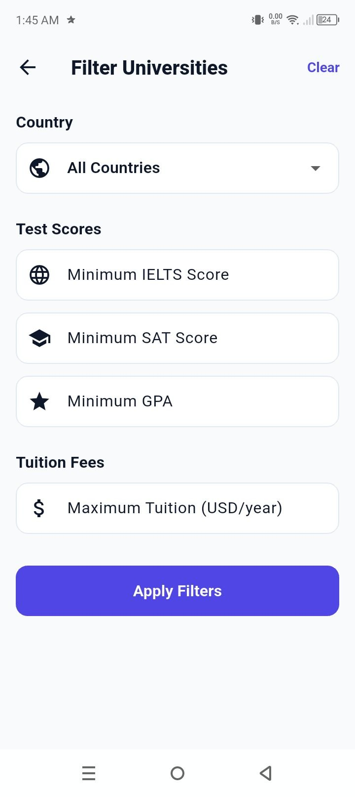
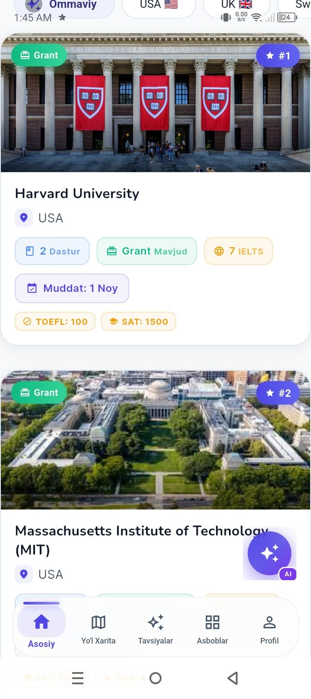
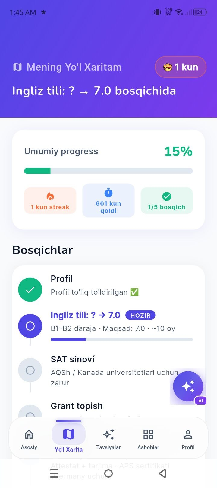
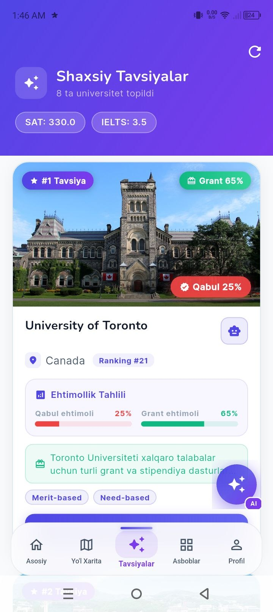
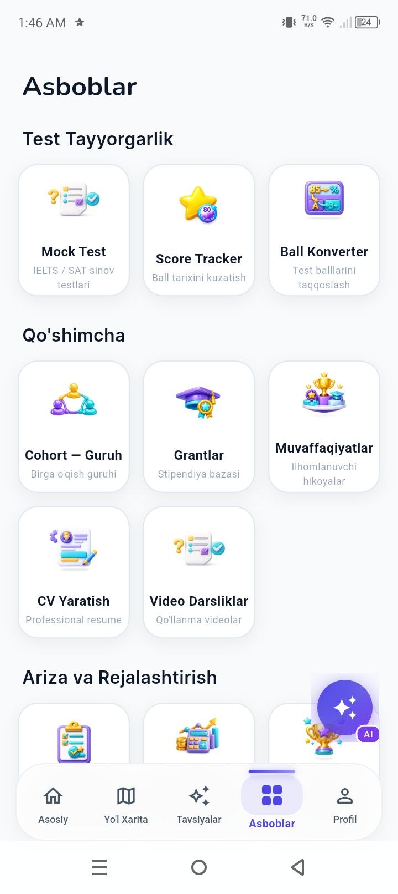
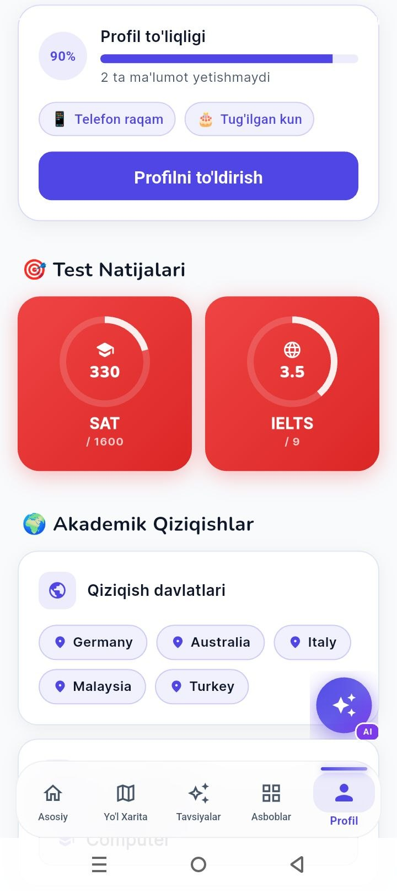

  

<h1 align="center">🚀 UnEdu</h1>

  <b>AI-Powered University & Scholarship Platform</b> 
  <i>From your current level → to your dream university</i>

  
  
  
  

---

## 🧠 What is UnEdu?

UnEdu is an **AI-powered decision system** that helps students plan their entire study abroad journey based on real academic data.

It doesn't just list universities —
it guides users with:

* 🎯 Smart university selection
* 📊 Admission & scholarship probability
* 🧭 Personalized roadmap
* 🤖 24/7 AI assistant

---

## ⚡ Core Features

* 🤖 AI Assistant (Gemini-powered, 24/7)
* 🎯 Smart university recommendations
* 📊 Admission & grant probability analysis
* 🧭 AI-generated roadmap system
* 🔍 Advanced filters (IELTS, SAT, GPA, Budget)
* 🧪 IELTS & SAT mock tests
* 📝 CV / Resume builder
* 💰 Budget calculator
* 📈 Progress tracking system

---

## 🎬 App Preview

  
  
  
  

  
  
  
  

---

## 🤖 AI System

UnEdu integrates AI deeply into the platform:

* 🧠 Profile analysis engine
* 📊 Probability prediction system
* 🧭 Dynamic roadmap generation
* 💬 Conversational assistant

Each user receives a **fully personalized AI experience**

---

## 🔐 Backend & Architecture

* Custom-built backend (no Firebase)
* Secure JWT authentication
* REST API architecture
* Scalable system design
* Data-driven logic system

---

## 🛠 Tech Stack

* **Mobile Development:** Flutter (Cross-platform)
* **Language:** Dart
* **Backend:** Custom-built
* **Architecture:** REST API
* **AI Integration:** Gemini

---

## 🎯 Problem Solved

Students often struggle with:

* Choosing the right university
* Understanding requirements
* Estimating scholarship chances
* Planning preparation

UnEdu transforms this into a **clear, data-driven process**

---

## 🚀 Product Status

🔥 Final stage of development
📱 Preparing for Google Play Store release

> This repository does not contain source code.
> The application will be publicly available soon.

---

## 🧠 What I Learned

* Building cross-platform mobile applications using Flutter
* Designing scalable backend systems from scratch
* Implementing secure authentication (JWT)
* Integrating AI into real-world applications
* Creating data-driven decision systems
* Developing user-centered product design

---

## 👤 Author

**Abdulatif Toxirjonov**
Aspiring Software Engineer focused on:

* AI Systems
* Backend Engineering
* Scalable Applications

---

  

